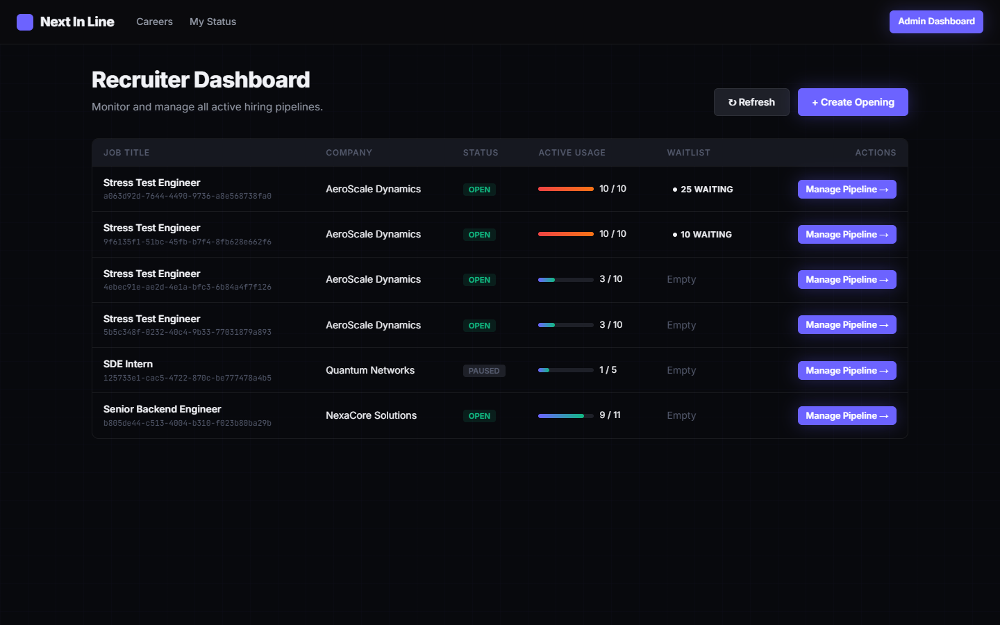
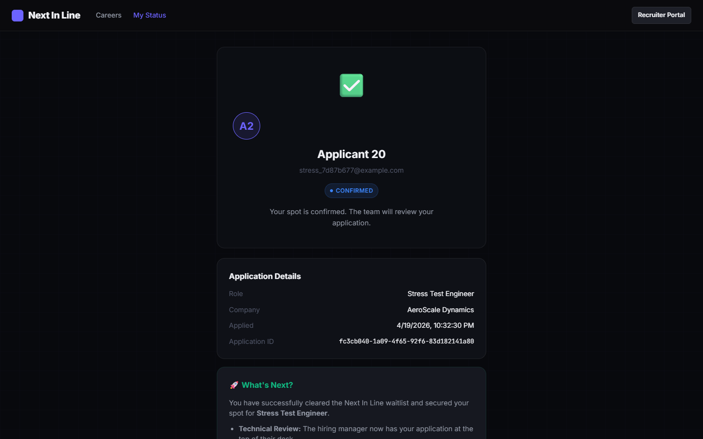
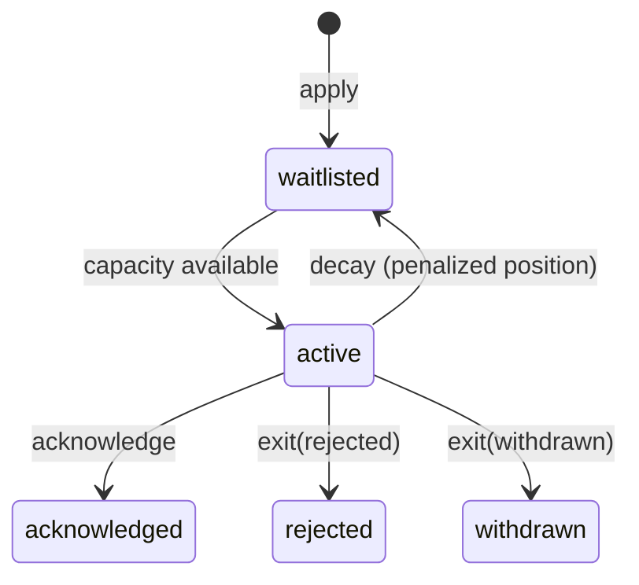

#  Next In Line

> A self-managing hiring pipeline for small engineering teams. No spreadsheets. No manual follow-ups. When someone exits, the next person promotes automatically.

[](https://nodejs.org)
[](https://postgresql.org)
[](https://reactjs.org)


---

## Table of Contents

- [Problem](#problem)
- [Solution](#solution)
- [Quick Start](#quick-start)
- [Architecture](#architecture)
- [Key Design Decisions](#key-design-decisions)
  - [Concurrency: The Last Slot Race](#concurrency-the-last-slot-race)
  - [Inactivity Decay](#inactivity-decay)
  - [Frontend Refresh Strategy](#frontend-refresh-strategy)
  - [State Machine](#state-machine)
- [API Reference](#api-reference)
- [Database Schema](#database-schema)
- [Tradeoffs](#tradeoffs)
- [What I'd Change With More Time](#what-id-change-with-more-time)

---

## Problem

Small engineering teams manage hiring on spreadsheets. They lose track of applicants, fail to follow up and manually chase people who stopped responding. Platforms like Greenhouse or Lever are overkill and expensive.

## Solution

Next In Line is a lightweight, self-managing pipeline with one core invariant:

> **The pipeline always tries to fill its active capacity. Automatically.**

- Company defines how many applicants are actively reviewed at once (**active capacity**)
- Applications beyond capacity enter a **waitlist** — not a rejection
- When an active applicant exits (rejected, withdrawn, or timed out), the **next waitlisted applicant promotes automatically**
- Promoted applicants must **acknowledge** within a defined window — or they **decay** back into the waitlist at a penalized position, and the cascade continues without any human touch

---

## App Previews


*The company pipeline view showing active and waitlisted applicants in real-time.*


*The self-service portal where applicants acknowledge promotions and track their status.*

---

## Quick Start

### Prerequisites

- Node.js 20+
- Docker & Docker Compose (for PostgreSQL)

### 1. Clone & install

```bash
git clone https://github.com/Sriya0001/Next_In_Line.git
cd Next_In_Line

# Install root, server, and client dependencies
npm run install:all
```

### 2. Configure environment

```bash
cp .env.example .env
# Edit .env if you want to change the database credentials
```

### 3. Start PostgreSQL

```bash
docker-compose up -d
```

### 4. Run migrations & seed

```bash
cd server
npm run migrate   # Creates all tables, enums, indexes
npm run seed      # Seeds demo data (3 active + 3 waitlisted applicants)
cd ..
```

### 5. Start dev servers

```bash
npm run dev       # Runs both server (port 4000) and client (port 5173) concurrently
```

Visit:
- **Frontend:** http://localhost:5173
- **API:** http://localhost:4000/api
- **pgAdmin:** http://localhost:5050 (admin@nextinline.dev / admin)

---

## Architecture

```
next-in-line/
├── server/                    # Express + Node.js backend
│   ├── src/
│   │   ├── config/db.js       # PostgreSQL connection pool
│   │   ├── db/migrate.js      # Schema migration
│   │   ├── db/seed.js         # Demo data seeder
│   │   ├── services/
│   │   │   └── pipelineEngine.js   # ★ Core business logic
│   │   ├── scheduler/
│   │   │   └── decayScheduler.js   # ★ Custom inactivity decay
│   │   ├── controllers/       # Request handlers
│   │   ├── routes/            # Express routers
│   │   └── middleware/        # Error handling, rate limiting
│   └── __tests__/             # Jest + Supertest tests
│       └── pipeline.test.js
└── client/                    # React + Vite frontend
    └── src/
        ├── api/index.js       # Axios client
        ├── hooks/usePolling.js # Polling & async action hooks
        ├── pages/
        │   ├── Landing.jsx    # Job listings + apply
        │   ├── Dashboard.jsx  # Company pipeline view
        │   └── ApplicantStatus.jsx  # Applicant self-service
        └── components/        # StatusBadge, CountdownTimer, EventFeed, etc.
```

---

## Key Design Decisions

### Concurrency: The Last Slot Race

**Problem:** Two applicants apply simultaneously for the last available slot. Both see `active_count = capacity - 1`. Without synchronisation, both could be inserted as `active`, violating capacity.

**Solution: PostgreSQL SERIALIZABLE transactions with `SELECT ... FOR UPDATE`.**

```sql
BEGIN TRANSACTION ISOLATION LEVEL SERIALIZABLE;
SELECT id, active_capacity FROM jobs WHERE id = $1 FOR UPDATE;
-- ^ This takes an exclusive row lock on the job row.
-- One of the two concurrent transactions blocks here.
-- The first to commit updates the active count.
-- The second re-reads the fresh count and falls to 'waitlisted'.
COMMIT;
```

Why this approach:
- **No external lock service needed** — PostgreSQL serialises it natively
- **No phantom reads** — SERIALIZABLE isolation prevents the anomaly entirely
- **No lost updates** — `FOR UPDATE` prevents concurrent writes to the same row
- **Auto-Retry Resiliency (`withTransaction`)** — If a serialization failure occurs between racing processes (Postgres error `40001`), the data wrapper automatically intercepts it, calculates an exponential backoff jitter, and safely retries the transaction. This guarantees the user is never inconvenienced by a DB locking clash.

This is fully documented and testable (see `Concurrency: race condition for last slot` test in `__tests__/pipeline.test.js`).

---

### Inactivity Decay

When an applicant is promoted from the waitlist to `active`, a clock starts.

**Decay window:** Configurable per job (default: **24 hours**).

If the applicant does not call `POST /applications/:id/acknowledge` before the deadline:

1. The **decay scheduler** (a custom `setInterval` loop running every **5 minutes**) queries:
   ```sql
   SELECT * FROM applications
   WHERE status = 'active'
     AND acknowledge_deadline IS NOT NULL
     AND acknowledge_deadline < NOW()
   ```

2. For each expired applicant, `decayApplication()` runs inside a **SERIALIZABLE transaction**:
   - Status → `waitlisted`
   - A penalty position is calculated:
     ```
     penalty_position = floor(waitlist_length × 0.3) + 1
     ```
   - Existing waitlist entries below that position are shifted down
   - The decayed applicant is re-inserted at `penalty_position`
   - `decay_penalty_count` increments (surfaced in UI as a 🔥 indicator)

3. `promoteNext()` is called to fill the vacated slot → **cascade continues automatically**

**Why 30% of waitlist length?**
- Small waitlist (5): penalty = 2 — small punishment, still near front
- Medium waitlist (10): penalty = 4 — meaningful setback
- Large waitlist (30): penalty = 10 — significant, but not permanent exclusion
- This is fair: it rewards responsiveness without being permanently punitive

**Why `setInterval` and not a cron library?**
- Zero extra dependencies — this is a core requirement of the challenge
- Fully transparent — anyone can read `decayScheduler.js` and understand exactly what runs
- **Cluster Safe (`pg_try_advisory_lock`)** — Before running, the node process securely acquires a session-level Postgres advisory lock (`ID 1001`). If you scale this app to 10 instances behind a load balancer, they will never clash or natively double-decay waitlists, without needing Redis!


### Frontend Refresh Strategy

**Choice: Polling every 30 seconds.**

Why not WebSockets?
- This is an **internal tool** — not a real-time consumer product
- The pipeline changes infrequently: rejections, promotions, and decays happen on the order of hours/days, not seconds
- WebSockets add infrastructure complexity (connection state, auth, reconnection logic) that isn't justified here
- 30s polling is imperceptible to users and has negligible server load

Why 30 seconds specifically?
- Fast enough that a company refreshing the dashboard sees near-current state
- Slow enough that a busy API (e.g. 100 users) doesn't thrash with requests
- The decay scheduler runs every 5 minutes — so there's no scenario where the UI lags more than ~30s behind the "true" state

**This choice is deliberate and traceable in the code:**
```js
const POLL_INTERVAL = 30000; // 30 seconds — deliberate polling strategy
```

---

### State Machine

Every application moves through a well-defined state machine:



All transitions are logged to `pipeline_events` — an append-only audit table. Every movement is traceable and reconstructable from this log alone.

---

## API Reference

Base URL: `http://localhost:4000/api`

### Jobs

| Method | Endpoint | Description | Body |
|--------|----------|-------------|------|
| `POST` | `/jobs` | Create a job opening | `{ title, company_name, active_capacity, description?, decay_window_hours? }` |
| `GET` | `/jobs` | List all jobs with counts | — |
| `GET` | `/jobs/:id` | Get job + active + waitlist | — |
| `PATCH` | `/jobs/:id/capacity` | Update active capacity | `{ active_capacity }` |
| `PATCH` | `/jobs/:id/status` | Open/pause/close a job | `{ status: "open"\|"paused"\|"closed" }` |
| `POST` | `/jobs/:jobId/apply` | Submit an application | `{ name, email }` |

### Applications

| Method | Endpoint | Description | Body |
|--------|----------|-------------|------|
| `GET` | `/applications/:id` | Get status, position, deadline | — |
| `POST` | `/applications/:id/acknowledge` | Acknowledge promotion | — |
| `PATCH` | `/applications/:id/exit` | Reject or withdraw | `{ reason: "rejected"\|"withdrawn" }` |
| `GET` | `/applications/:id/events` | Full audit trail for one application | — |

### Pipeline

| Method | Endpoint | Description | Query Params |
|--------|----------|-------------|---|
| `GET` | `/pipeline/:jobId` | Full snapshot: active + waitlist + stats | — |
| `GET` | `/pipeline/:jobId/events` | Paginated job event log | `page`, `limit` |

### Admin (dev only)

| Method | Endpoint | Description |
|--------|----------|-------------|
| `GET` | `/admin/stats` | System-wide counts |
| `POST` | `/admin/trigger-decay` | Manually trigger decay cycle |

### Response Format

All responses follow this shape:

```json
{
  "data": { ... },
  "message": "Optional human-readable message",
  "pagination": { ... }  // only on paginated endpoints
}
```

Errors:
```json
{
  "error": {
    "message": "Human-readable error",
    "stack": "..."    // only in development mode
  }
}
```

---

## Database Schema

### `jobs`
| Column | Type | Notes |
|--------|------|-------|
| `id` | UUID PK | |
| `title` | TEXT | |
| `description` | TEXT | nullable |
| `company_name` | TEXT | |
| `active_capacity` | INT | Min 1 |
| `decay_window_hours` | INT | Default 24 |
| `status` | `job_status` | `open`, `paused`, `closed` |
| `created_at` | TIMESTAMPTZ | |
| `updated_at` | TIMESTAMPTZ | Auto-updated via trigger |

### `applicants`
| Column | Type | Notes |
|--------|------|-------|
| `id` | UUID PK | |
| `name` | TEXT | |
| `email` | TEXT UNIQUE | |
| `created_at` | TIMESTAMPTZ | |

### `applications`
| Column | Type | Notes |
|--------|------|-------|
| `id` | UUID PK | |
| `job_id` | UUID FK | |
| `applicant_id` | UUID FK | |
| `status` | `application_status` | `active`, `waitlisted`, `acknowledged`, `rejected`, `withdrawn` (Note: `decayed` is a transient event logged to `pipeline_events`, not a final status) |
| `waitlist_position` | INT | NULL when active/acknowledged |
| `decay_penalty_count` | INT | Increments each decay |
| `promoted_at` | TIMESTAMPTZ | When last promoted |
| `acknowledge_deadline` | TIMESTAMPTZ | `promoted_at + decay_window_hours` |
| `applied_at` | TIMESTAMPTZ | |

### `pipeline_events` (append-only audit log)
| Column | Type | Notes |
|--------|------|-------|
| `id` | UUID PK | |
| `application_id` | UUID FK | |
| `job_id` | UUID FK | |
| `applicant_id` | UUID FK | |
| `event_type` | `event_type` | `applied`, `activated`, `waitlisted`, `promoted`, `acknowledged`, `rejected`, `withdrawn`, `decayed`, `requeued`, `capacity_changed` |
| `from_status` | TEXT | |
| `to_status` | TEXT | |
| `from_position` | INT | |
| `to_position` | INT | |
| `metadata` | JSONB | Extra context (timing, penalty counts, etc.) |
| `created_at` | TIMESTAMPTZ | |

---

## Tradeoffs

| Decision | What I chose | Why | Cost |
|----------|-------------|-----|------|
| **Concurrency** | SERIALIZABLE txn + FOR UPDATE | Correct-by-default, no app-level state | Slight write latency under high concurrent load |
| **Decay trigger** | `setInterval` every 5 min | Zero dependencies, fully transparent | Max ~5min lag in decay + cascade |
| **Frontend refresh** | 30s polling | No infra overhead, sufficient for internal tool | Stale by up to 30s |
| **Auth** | None (link-based) | Scope appropriate for internal tool | No identity verification |
| **Penalized re-queue** | 30% of waitlist length | Fair decay without permanent exclusion | Slightly complex position math |
| **UUID PKs** | Yes | Collision-safe, sharable applicant links | Larger index size vs. serial IDs |
| **Monolith layout** | Single Express app | Simple local dev, no service mesh | Harder to independently scale components |

---

## Running Tests

```bash
cd server
npm test
```

Tests cover:
- Job creation validation (Requirement #1)
- Apply: activation vs waitlisting (Requirement #2)
- Concurrency: simultaneous last-slot race (Requirement #5)
- Acknowledge: valid + invalid states (Requirement #4)
- Exit: cascade promotion after rejection (Requirement #3)
- Capacity increase → promotion from waitlist (Requirement #2 & #3)
- Capacity decrease → demotion to waitlist (Requirement #2)
- Audit log completeness (Requirement #6)

---

## What I'd Change With More Time

1. **Real-time updates via WebSockets** — `socket.io` room per job; emit pipeline events on every state change
2. **Auth layer** — Company JWT login + applicant token-based link (UUID in URL is sufficient but not authenticated)
3. **Multi-job dashboard** — Company home screen showing all open positions at a glance
4. **Database migrations framework** — Replace the inline migration script with `node-pg-migrate` or `db-migrate` for versioned, reversible schema changes
5. **Observability** — Structured JSON logging (Winston + Pino), metrics endpoint for Prometheus scraping
6. **Horizontal Scaling** — The system is already built for scale (using PostgreSQL SERIALIZABLE transactions and advisory locks for the decay scheduler); it could be safely deployed behind a load balancer with multiple Node instances natively.

---

## License

Copyright © 2026 Sriya K
